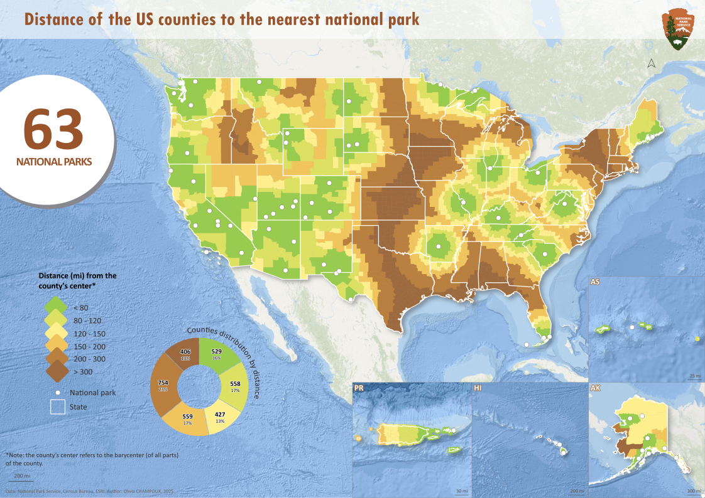
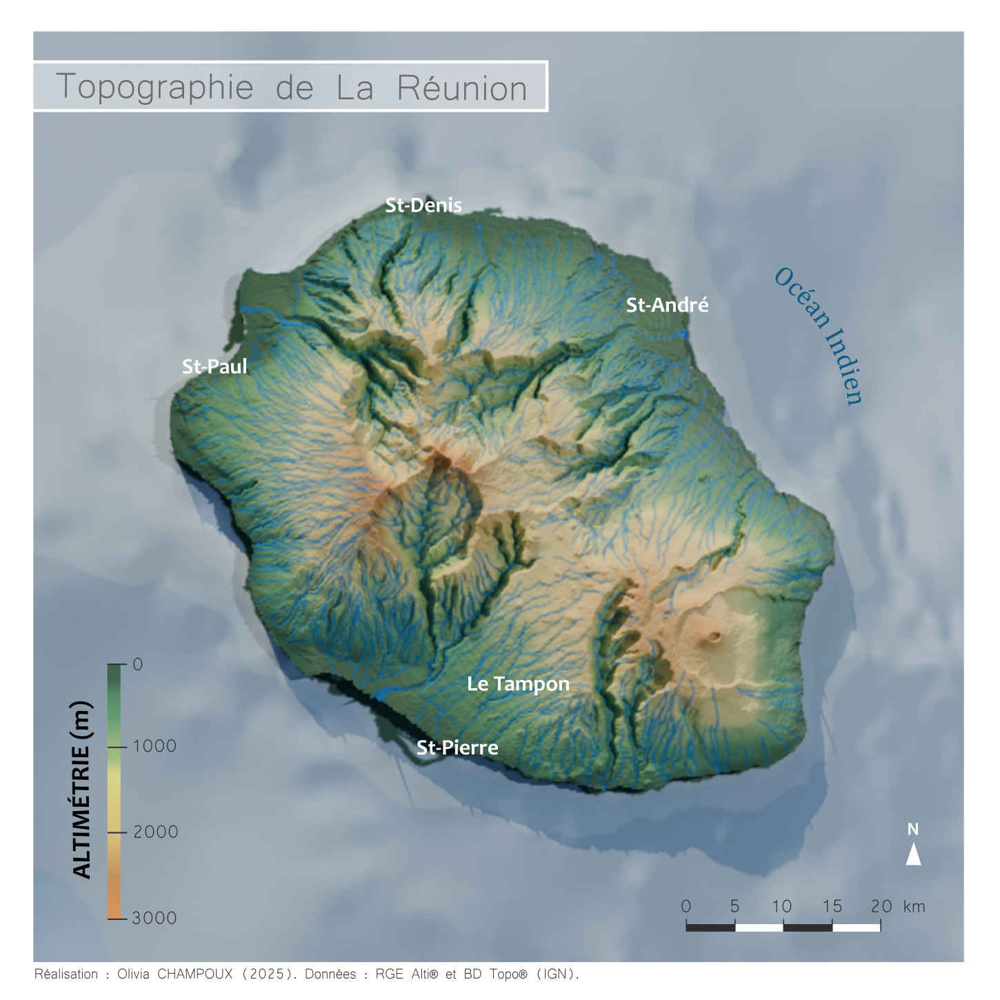

**Under construction**

Distance of the US counties to the nearest national park (source: National Park Service). Method: nearest neighbor analysis.

Topographic map of La Réunion, France. 3D map made with Blender.

Meteorites that have struck our planet between 1990 and 2013 (source: NASA).

