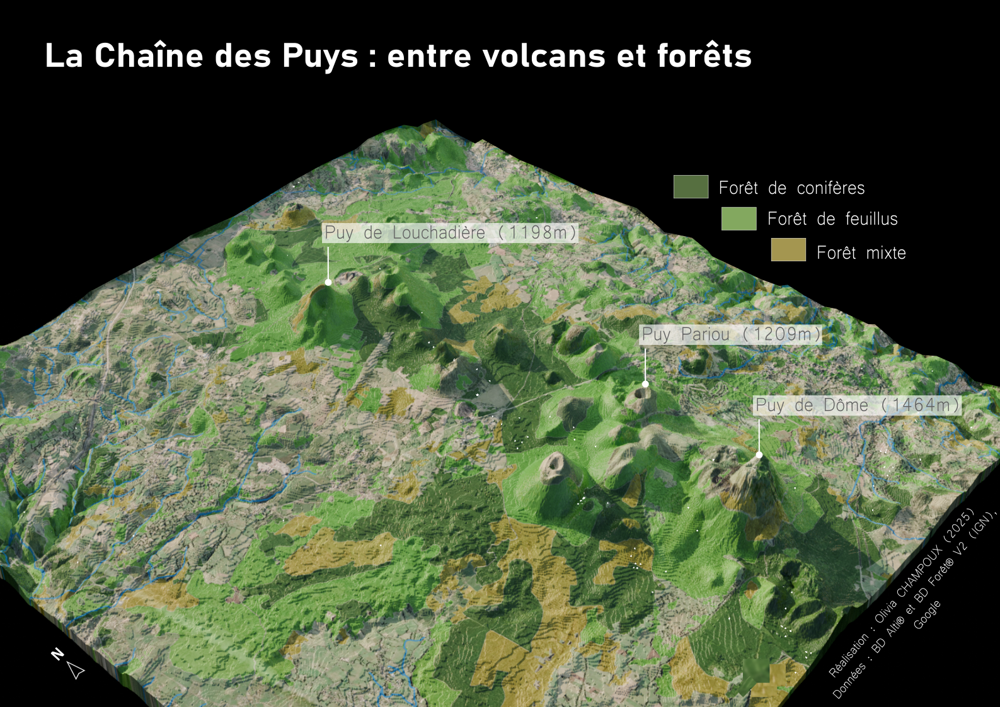

**Under construction**

Meteorites that have struck our planet between 1990 and 2013 (source: NASA).

Distance of the US counties to the nearest national park (source: National Park Service). Method: nearest neighbor analysis.

Forests of the _Chaîne des Puys_, in the Massif Central of France. 3D map made with Blender.

